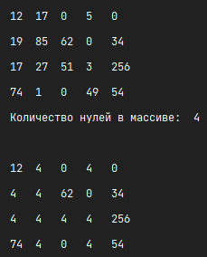
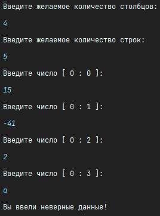

# BMK01_Table-array

## Современное кроссплатформенное программирование

### Задание №3.1

Имеется двухмерный массив 4x5 в виде списка. Сделать консольную программу, которая вводит данные массива с клавиатуры,
осуществляет заданный вариантом алгоритм и выводит полученный список-результат на экран.

### Вариант №1

Подсчитать количество нулей в таблице и заменить на это значение все нечетные целые элементы таблицы.

## Вывод

## Ошибка

