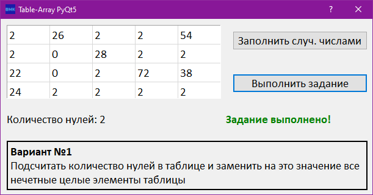
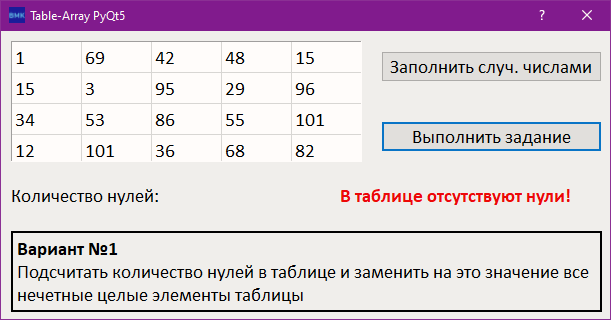

# BMK01_PyQt5_Table-array

## Современное кроссплатформенное программирование

### Задание №3.2

Имеется двухмерный массив 4x5. Кнопка «Заполнить случайными числами» заполняет массив случайными значениями от -0 до

100. Кнопка «Выполнить задание» выполняет обработку таблицы «QTableWidget» по заданному в варианте алгоритму.

### Вариант №1

Подсчитать количество нулей в таблице и заменить на это значение все нечетные целые элементы таблицы.

## Решение

## Ошибка

